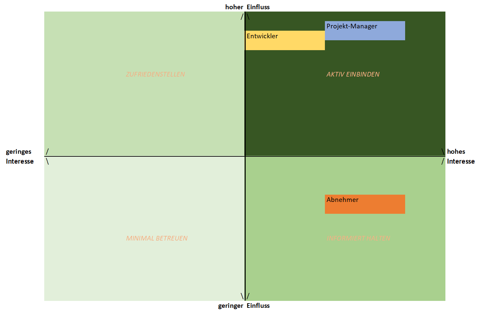

# Stakeholder-Analyse
In der Stakeholder-Analyse untersuchen wir Einflussnehmer und Entscheidungsträger genauer. Dabei gehen wir wie folgt vor:

1. **Identifizieren** 
Ermitteln aller relevanter Stakeholder anhand folgender Leitfragen:
    * Wer hat Einfluss auf das Projekt
    * Wer profitiert vom Projekt?
    * Wem könnte das Projekt schaden?
    * Welche Rahmenbedingungen müssen berücksichtigt werden?
2. **Beschreiben** 
Detailierte Beschreibung der Stakeholder:
    * Welche Werte, Ziele, Einstellungen und Motive haben sie?
    * Welchen Einfluss haben sie auf das Projekt und andere Stakeholder?
    * Wie können sie beeinflusst werden?
3. **Bewertung** 
Bewertung erfolgt anhand folgender Größen:
    * Interesse am Projekt
    * Einfluss am Projekt
    * Einstellung zum Projekt
4. **Visualisierung** 
Darstellung des Einflusses und Interesses der Stakeholder:
    * Power-Interest-Matrix nach Mendelow
    * bei Bedarf Netzwerkdiagramme für Beziehungen zw. Stakeholdern
5. **Planen** 
Entwicklung einer geeigneten Engagement-Strategie:
    * Definieren Sie Kommunikationskanäle und -frequenzen
    * Planen Sie konkrete Maßnahmen zur Einbindung
    * Legen Sie Verantwortlichkeiten fest
6. **Verbessern** 
 Dokumentation von Erfahrungen und Lessons Learned:
    * Identifikation von Veränderungen in der Stakeholder-Landschaft
    * Anpassungen der Stakeholder-Analyse an geänderte Umstände

## Power-Index-Matrix

## Strategieempfehlung
| Quadrant | Strategie | Empfohlenes Vorgehen |
| --- | --- | --- |
| hoher Einfluss, hohes Interesse | **aktiv einbinden** | - volle Beteiligung sicherstellen - regelmäßgige Gespräche - Einbindung in Entscheidungsprozesse - Prioritäten und Bedenken berücksichtigen |
| hoher Einfluss, niedriges Interesse | **zufriedenstellen** | - regelmäßig informieren - Zufriedenheit sicherstellen - nicht mit Details langweilen - auf spezifische Interessen eingehen |
| hoher Einfluss, hohes Interesse | **informiert halten** | - regelmäßig informieren - Feedback einholen - als Unterstützer/Experten einbinden - bei Detailfragen konsultieren |
| hoher Einfluss, niedriges Interesse | **minimal betreuen** | - beobachten - minimaler Kommunikationsaufwand - keine Überkommunikation - bei Bedarf informieren |
